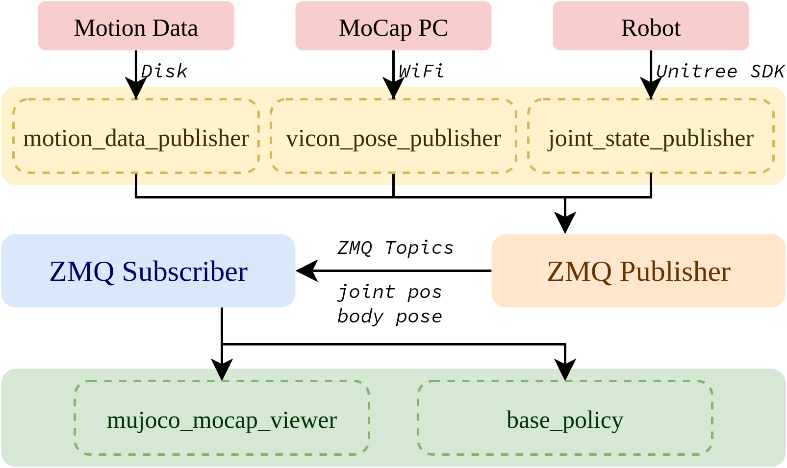

# HDMI: Learning Interactive Humanoid Whole-Body Control from Human Videos

<div align="center">
<a href="https://hdmi-humanoid.github.io/">
  
</a>

<a href="https://www.youtube.com/watch?v=GvIBzM7ieaA&list=PL0WMh2z6WXob0roqIb-AG6w7nQpCHyR0Z&index=12">
  
</a>

<a href="https://arxiv.org/pdf/2509.16757">
  
</a>

<a href="https://github.com/EGalahad/sim2real/stargazers">
    
</a>
</div>

HDMI is a framework that enables humanoid robots to acquire diverse whole-body interaction skills directly from monocular RGB videos of human demonstrations. This repository contains the official sim2sim and sim2real code for **HDMI: Learning Interactive Humanoid Whole-Body Control from Human Videos**.

## Environment Setup

```bash
uv sync
source .venv/bin/activate
```

If you prefer conda, create a Python 3.12 environment and `pip install -r requirements.txt`.

## Sim2Sim
The sim2sim setup runs a MuJoCo environment and a reinforcement-learning policy as two Python processes that communicate over ZMQ. After both processes are up, press `]` in the policy terminal to start, then press `9` in the MuJoCo viewer to disable the virtual gantry immediately.

### Example Scenarios
**Move suitcase**
```bash
# terminal 1: start MuJoCo
python sim_env/hdmi.py --robot_config config/robot/g1.yaml --scene_config config/scene/g1_29dof_rubberhand-suitcase.yaml
# terminal 2: start policy
python rl_policy/tracking.py --robot_config ./config/robot/g1.yaml --policy_config checkpoints/G1TrackSuitcase/policy-v55m8a23-final.yaml
```

**Open door**
```bash
python sim_env/hdmi.py --robot_config config/robot/g1.yaml --scene_config config/scene/g1_29dof_rubberhand-door.yaml
python rl_policy/tracking.py --robot_config ./config/robot/g1.yaml --policy_config checkpoints/G1PushDoorHand/policy-xg6644nr-final.yaml
```

**Roll ball**
```bash
python sim_env/hdmi.py --robot_config config/robot/g1.yaml --scene_config config/scene/g1_29dof_rubberhand-ball.yaml
python rl_policy/tracking.py --robot_config ./config/robot/g1.yaml --policy_config checkpoints/G1RollBall/policy-yte3rr8b-final.yaml
```

## Sim2Real
The sim2real pipeline uses ZMQ to relay motion capture and robot state to the controller running on the Unitree G1.



### Quick Smoke Test (ONNX)
```bash
python scripts/test_onnx_inference.py --policy_config checkpoints/G1TrackSuitcase/policy-v55m8a23-final.yaml
```

### Required Setup
- Target platform: onboard Orin Jetson of the Unitree G1 (ssh into the robot and copy this codebase).
- Install the Unitree C++ SDK Python binding from https://github.com/EGalahad/unitree_sdk2 to enable 50 Hz control. Update the import path in `rl_policy/base_policy.py` after building the binding.

### Mocap Data Relay and Visualization
1. Relay pelvis/object poses from the mocap server:
   ```bash
   python scripts/publishers/vicon_pose_publisher.py
   ```
2. Publish robot joint poses via ZMQ:
   ```bash
   python scripts/publishers/joint_state_publisher.py
   ```
3. Visualize mocap data locally (subscribes to the same ZMQ topics):
   ```bash
   python scripts/vis/mujoco_mocap_viewer.py
   ```

### Running on the Real Robot
- Use the real-robot config: `config/robot/g1-real.yaml`.
- Launch the policy with the desired checkpoint (same commands as sim2sim, swapping the robot config). Ensure the mocap relay and joint publishers are running so the controller receives ZMQ topics for joint position and body pose.

## Star History

[](https://www.star-history.com/#EGalahad/sim2real&type=date&legend=top-left)
